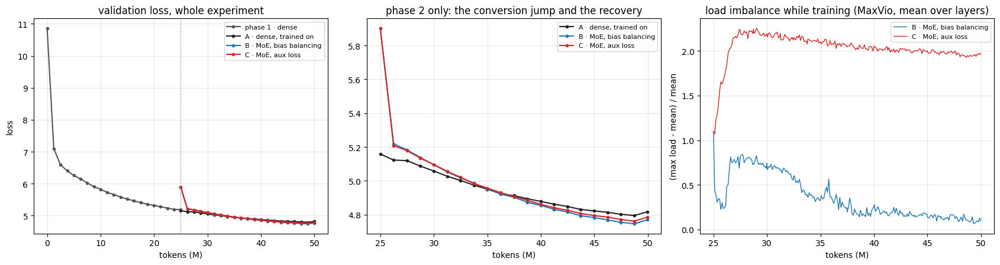
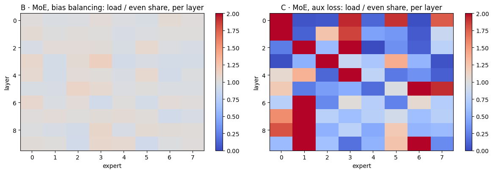

# Session 14 — Growing a dense model into a mixture of experts

**Stephen Raj Arokiasamy**

**Notebook:** [`S14_upcycle.ipynb`](S14_upcycle.ipynb)
**Executed on a free Colab T4:** [`S14_upcycle_op.ipynb`](S14_upcycle_op.ipynb) — fp16 + loss scaler, torch 2.11, same source as the notebook, cell for cell
**Verifier:** `python3 verify_local.py` — 14 cells, 34 checks, runs offline in about ten seconds

The assignment: *train a dense model, convert it into a mixture of experts (MoE), and show that it keeps
training and keeps reducing its loss.*

---

## The answer

A 20.9M-parameter GPT trains dense for 25M tokens of FineWeb-Edu. At that point three branches start
from the **same checkpoint** and train on the **same next 25M tokens**, in the same order, with the
same learning-rate schedule:

| branch | model | val loss at the start | at 25M more tokens | tokens/s |
|---|---|---|---|---|
| A · dense, trained on | 20.88M | 5.1587 | **4.8172** | 41,755 |
| B · MoE, bias balancing | 57.6M total / 26.1M active | 5.9023 | **4.7701** | 32,702 |
| C · MoE, auxiliary loss | 57.6M total / 26.1M active | 5.9023 | **4.7854** | 32,176 |

**Yes, the converted model keeps training and keeps reducing its loss.** Over phase 2 it gains 1.13
nats, starting from a deliberately damaged state. More importantly, **it ends up better than the dense
model it came from**, which saw exactly the same tokens:

* by **0.047** with bias balancing, and by 0.032 with the auxiliary loss, at equal tokens;
* by **0.039** at equal compute. Each MoE token costs 22% more FLOPs, so for the dense run's total
  budget the MoE only reaches 20.4M tokens into phase 2. Its interpolated loss there is 4.7781, against
  the dense model's 4.8172.

The shape of the curve matters as much as its end:

```
conversion         the MoE starts 0.74 nats WORSE than the dense model (half of every expert redrawn)
+11.3M tokens      it catches the dense model
+25M tokens        it is 0.047 ahead, and the gap is still widening
```





*(If the image does not render: the notebook's cell 12 draws it. The small upward tick at the end of
every curve is not the model getting worse. The last point is the final evaluation on 512 sequences,
and the rest of each curve uses 128. On the same weights the two sets differ by 0.03: 5.1897 against
5.1587 at the conversion point. Every comparison below uses the same set on both sides.)*

---

## 1 · What the conversion does, in my own words

A dense block sends every token through one feed-forward network (FFN): 256 → 1,024 → 256. The MoE
block keeps attention unchanged, and replaces that one FFN with **8 FFNs of the same shape** plus a
**router**. The router is a 256 × 8 matrix that scores all 8 for each token. Each token uses its
**top 2**, and their outputs are mixed with the router's weights, renormalised to add up to one.

So the model now stores 8 FFNs per layer but each token runs 2. Total parameters grow 2.76×
(20.88M → 57.60M). Active parameters grow only 1.25× (→ 26.15M), and FLOPs per token 1.22×. That is
the whole economic argument of the lesson in one layer: **capacity follows the total, cost follows
the active**.

**How the 8 experts are made.** They could simply be 8 copies of the dense FFN. My check (a) proves
that plain copying reproduces the dense model *exactly*: with identical experts,
`g₁·FFN(x) + g₂·FFN(x) = FFN(x)`, and the loss gap is 0.0. But identical experts are the problem the
lesson describes in §15. The router cannot tell them apart, so clones collapse together.
**Drop-upcycling** (Nakamura et al., ICLR 2025) breaks the symmetry on purpose. Each expert keeps a
random half of the dense FFN's 1,024 hidden neurons. The other half is redrawn as Gaussian noise with
the mean and standard deviation of the weights it replaces. Two experts share about a quarter of their
neurons: I measured an overlap of **0.249** against r² = 0.250. So they start related, but different.

**The price is visible**: the MoE starts **0.74 nats worse** (5.1587 → 5.9023, 14% of the loss). Half
of every expert's knowledge was thrown away, and the router is brand new and nearly uniform. The payoff
is that the experts can diverge in what they do (§4).

## 2 · Does it keep training? Yes — and faster than the model it came from

| | loss gained during phase 2 |
|---|---|
| dense, trained on | 0.34 nats |
| MoE, bias balancing | **1.13 nats** |

The MoE recovers the damage from the conversion and then passes the dense model **11.3M tokens after
conversion**, 45% of the way through phase 2. At the end the curves are still separating (middle panel
above). That is the result the assignment asks for, measured against the dense model rather than just
against the MoE's own starting point.

The comparison is fair by construction:

* identical checkpoint, token order, batches and learning-rate schedule;
* both branches start with a **fresh optimizer** and the same 100-step warmup, since the experts are
  new tensors with no Adam history;
* the conversion is the only difference.

## 3 · Balancing: the bias method balances, the auxiliary loss does not

| | final MaxVio | dead experts | final val loss |
|---|---|---|---|
| **bias** (γ = 0.001, used for choosing only) | **0.08** | 0 | **4.7701** |
| auxiliary loss (α = 0.01) | **1.95** | 0 | 4.7854 |

MaxVio is (busiest expert − mean) / mean, averaged over the 10 layers. 1.95 means the busiest expert
in a typical layer takes almost three times its fair share. The heat map in the notebook shows it: with
the auxiliary loss, every layer has one to three experts at 2× or more, and experts at a quarter of
their share. With the bias method, every cell is within a few percent of even.

The dynamics are worth reading from the right panel of the figure. With the bias method, imbalance
rises to about 0.8 in the first million tokens, then falls steadily to 0.08. The bias moves only
0.001 per step, so it takes a few hundred steps to catch up with a router that is still settling. With
the auxiliary loss, imbalance climbs to about 2.2 and stays there. At α = 0.01 the balancing gradient
simply loses to the language-model gradient. That is the tension the lesson's §12 describes, and the
reason §13's method exists: the bias steers selection without touching the loss.

It also shows in the loss. The better-balanced run is 0.015 better, which agrees with Wang et al.'s
finding that the bias method gives both better balance and better perplexity. **No expert died in
either run.** Drop-upcycling's different starting points gave every expert something to be chosen for.

## 4 · What the experts learned

The lesson's §9 says experts specialise mostly by **kind of token**, not by subject. That was checkable
directly. At a middle layer (layer 5), each validation token went into a category by its text, and I
measured the share of that category's two picks going to its favourite expert. One expert can take at
most half, because a token's two picks must be different, and the even share is 12.5%.

| token kind | tokens | favourite expert | its share | tokens that pick it |
|---|---|---|---|---|
| whitespace / newline | 517 | 7 | 49.2% | **98%** |
| digits | 537 | 3 | 45.0% | **90%** |
| punctuation | 4,417 | 7 | 33.8% | 68% |
| word piece (no leading space) | 3,527 | 3 | 33.4% | 67% |
| capitalised word | 2,991 | 3 | 30.0% | 60% |
| lowercase word | 20,779 | 6 | 18.9% | 38% |

**Almost every newline goes to expert 7, and 90% of digits go to expert 3**, only 25M tokens after
conversion. Ordinary lowercase words, the bulk of the text, stay close to spread out. That is the
lesson's picture exactly: specialisation by token *type*, with the common case shared.

One result I did not expect. The experts' weights did **not** move apart. The mean pairwise cosine
similarity of their `fc` matrices rose slightly, from 0.250 at conversion to 0.263 (B) and 0.267 (C).
The experts specialised in *which tokens they receive* while their weights stayed about as similar as
drop-upcycling made them. So weight similarity is a poor proxy for specialisation, and routing
statistics are the right measurement.

## 5 · What it costs

| | dense | MoE | ratio |
|---|---|---|---|
| parameters stored | 20.88M | 57.60M | 2.76× |
| parameters used per token | 20.88M | 26.15M | 1.25× |
| training FLOPs per token | 141.0M | 172.6M | 1.22× |
| tokens per second, T4 | 41,755 | 32,702 | 0.78× |
| peak memory | 3.15 GiB | 5.17 GiB | 1.64× |

Measured speed is 22% lower, and the FLOP count alone predicts 18%. So routing costs about **4%** on
top of the arithmetic: scoring, the gather into each expert, and the weighted scatter back. That is
small for a straightforward loop over the experts, because each expert still receives about 4,096 of
the 16,384 tokens per step, which is enough to keep the matrix units busy (§16 of the lesson).

Of the +2.02 GiB of peak memory, only 0.55 GiB is the extra parameters and their Adam state. The rest
is the dispatch: each token's vector is copied to its two experts, and the results are accumulated in
fp32. **Memory follows the total and the traffic; compute follows the active.**

## 6 · Checks before any training

| check | result |
|---|---|
| conversion with nothing redrawn reproduces the dense loss | gap **0.0** (10.859109 both) |
| …and one layer's output on random input | max difference 3.6e-07 |
| drop-upcycling redraws exactly half of each expert | 512 of 1,024, kept neurons bit-identical |
| two experts' redrawn sets overlap as independent halves should | 0.249 (r² = 0.250) |
| the bias changes which experts are chosen, never their weights | probabilities and weights unchanged to 0.0 |
| the Switch auxiliary term at its extremes | 1 when even; **N** at top-1 collapse; **N/2** at top-2 collapse |

The last row corrects something the lesson glosses. §12 gives α·N for collapse, but that holds only
for top-1. With top-2, a token's two picks must be different experts, so no expert can take more than
half of the dispatched copies. The maximum is then N/2, and with α = 0.01 and N = 8 that is 0.04, not
0.08.

## What I would not claim

* **That drop-upcycling beats training an MoE from scratch.** That comparison was not run. The lesson
  cites crossovers between 25% and 120% of the dense budget, and 25M tokens is far too short to find
  one.
* **That r = 0.5 is the right amount to redraw at this size.** It cost 0.74 nats up front. A smaller
  r would cost less, but might diverge less. One value, one seed.
* **That the balancing ranking holds in general.** The auxiliary loss was run at α = 0.01 only; a
  larger α would balance better at some cost to loss, as the lesson's 2024 study found.
* **That the whole gain is capacity.** The MoE also does 22% more work per token. The equal-compute
  comparison (0.039 ahead) is the fairer figure, and it is still positive.
* **That checkpoint resume was exercised on the GPU.** Drive did not mount (a credential error) and the
  session did not disconnect. Resume is proven offline, where an interrupted MoE run resumes to a
  bit-identical loss curve, load curve and set of biases.

## Reproduce

```bash
python3 verify_local.py      # 14 cells, 34 checks, ~10 seconds on CPU
```

The verifier runs the notebook's own cells with a miniature model and synthetic data. It then
re-derives each claim independently, including:

* the dense / total / active parameter counts from the shapes, for the miniature and for the Colab
  configuration;
* that with r = 0 every expert **is** the dense FFN, in every layer;
* that redrawn weights match the mean and spread of the ones they replace, and that non-FFN weights
  are copied unchanged;
* that phase 2 trains only on tokens phase 1 never saw;
* that the bias run's biases moved in whole multiples of γ and the auxiliary run's never moved;
* that an interrupted MoE run resumes bit-identically, biases included;
* that the findings cell contains no typed-in number and no fixed verdict.

Source: Nakamura et al., [Drop-Upcycling: Training Sparse Mixture of Experts with Partial
Re-initialization](https://arxiv.org/abs/2502.19261) (ICLR 2025).
